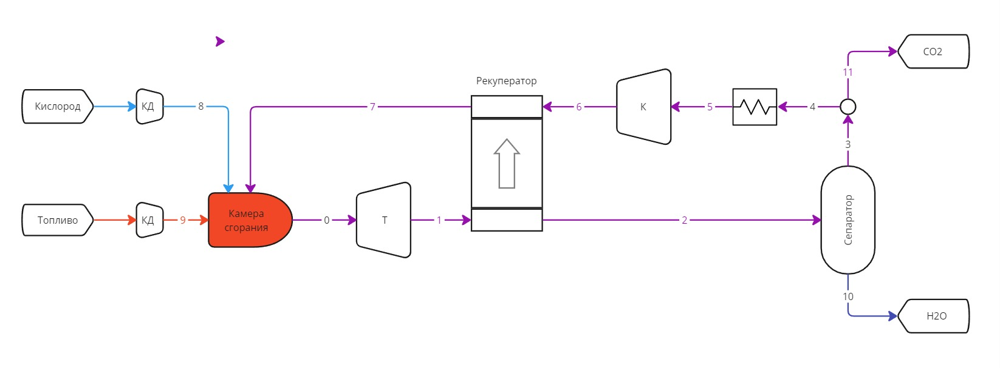

# Allam cycle calculation
The program is based on the liquid properties library `coolProp`.

## Navigation

## Project structure

## Allam cycle diagram

### Units systems
- temperature - degree Celsius _[°C]_;
- absolute pressure _[Pa]_

## List of variables
- `fluid` - name of gas (class instance `FluidList`)
- `mol_mass` - molar mass _[kg/mol]_
- `mol` - mole fraction
- `mass` - mass fraction

## List of methods

## Examples

## Parameters
The fractional composition of the fuel is specified 
in the form of a dictionary. Key - faction name (str). Properties tuple:
- `fluid`
- `mol`
- volumetric heat of combustion at 0 deg. C _[J/m3]_

## Returns:

## Термодинамические свойства sCO2. Теоретическая полезная работа цикла

## Тепловая модель камеры сгорания

## Расчет цикла

### Фазовая диаграмма

## Исследование рекуператора

## About the author
Sergey Besedin, dr. of sc., prof.

Andry Fydorov, engineer