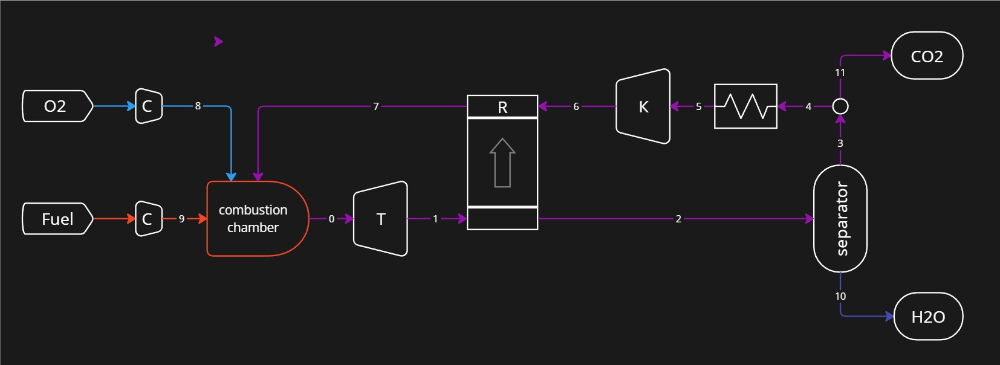

# Allam cycle calculation
The Allam cycle, patented in 2013 by Rodney Allam, 
uses oxy-combustion and a supercritical CO2 stream 
as the working fluid to produce high-purity liquid pipeline CO2.

The program is based on the liquid properties library `coolProp`.

# Navigation
<!-- TOC -->
* [Allam cycle calculation](#allam-cycle-calculation)
* [Navigation](#navigation)
* [Project structure](#project-structure)
* [Allam cycle diagram](#allam-cycle-diagram)
    * [Units systems](#units-systems)
  * [List of variables](#list-of-variables)
  * [List of methods](#list-of-methods)
  * [Examples](#examples)
  * [Parameters](#parameters)
  * [Returns:](#returns)
  * [Термодинамические свойства sCO2. Теоретическая полезная работа цикла](#термодинамические-свойства-sco2-теоретическая-полезная-работа-цикла)
  * [Тепловая модель камеры сгорания](#тепловая-модель-камеры-сгорания)
  * [Расчет цикла](#расчет-цикла)
    * [Phase diagram CO2](#phase-diagram-co2)
  * [Исследование рекуператора](#исследование-рекуператора)
  * [About the authors](#about-the-authors)
<!-- TOC -->


# Project structure

- `phasediagramCO2` class - an implementation of the CO2 phase diagram.

# Allam cycle diagram



### Units systems
- temperature - Kelvins _[K]_;
- absolute pressure _[Pa]_

## List of variables
- `fluid` - name of gas (class instance `FluidList`)
- `mol_mass` - molar mass _[kg/mol]_
- `mol` - mole fraction
- `mass` - mass fraction

## List of methods


## Parameters
The fractional composition of the fuel is specified 
in the form of a dictionary. Key - faction name (str). Properties tuple:
- `fluid`
- `mol`
- volumetric heat of combustion at 0 deg. C _[J/m3]_

## Returns:


# Examples

## CO2 phase diagram 

Calculation of $CO_2$ phase diagram.

```python
from allam import PTdiagrCO2
diagr = PTdiagrCO2()
diagr.plot()
```


## sCO2 thermodynamic properties. 

### Specific heat

Dependence of specific isobaric heat capacity $sCO_2$ on pressure 
at different temperatures.

- `pressure` *(tuple)* - minimum and maximum absolute pressure *[Pa]*: 
- `temperature` *(tuple)* - temperature *[°C]*

```python
from allam import PropSCO2
temperature = (32, 40, 50, 60, 600)
ts = PropSCO2()
ts.diagramm_pressure(pressure=(1e6, 20e6), temperature=temperature)
```


## Теоретическая полезная работа цикла


## Тепловая модель камеры сгорания


## Расчет цикла


## Исследование рекуператора


## About the authors
Sergey Besedin, dr. of sc., prof.

Andry Fydorov, engineer