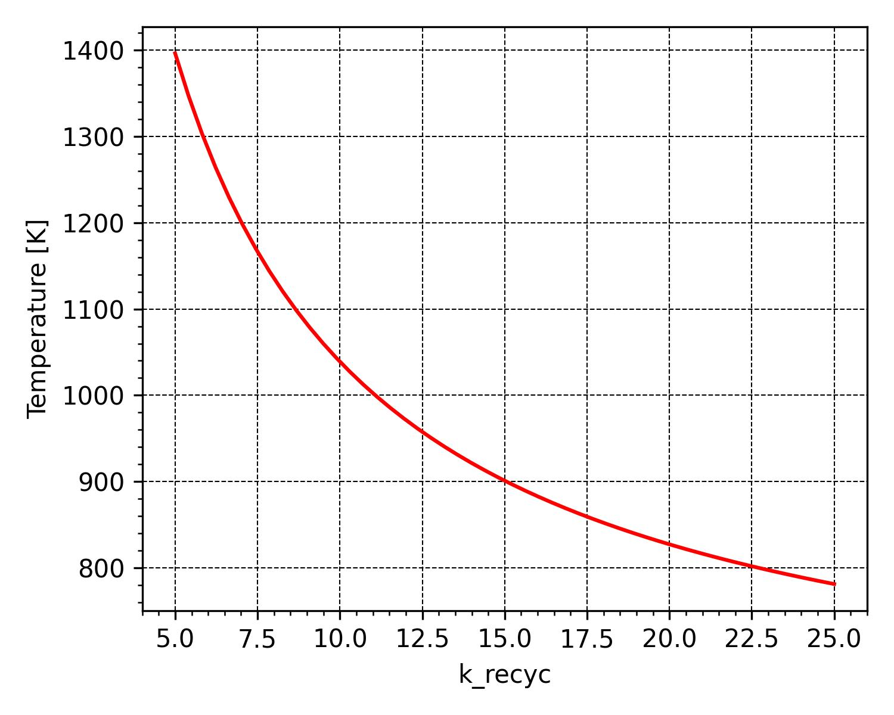
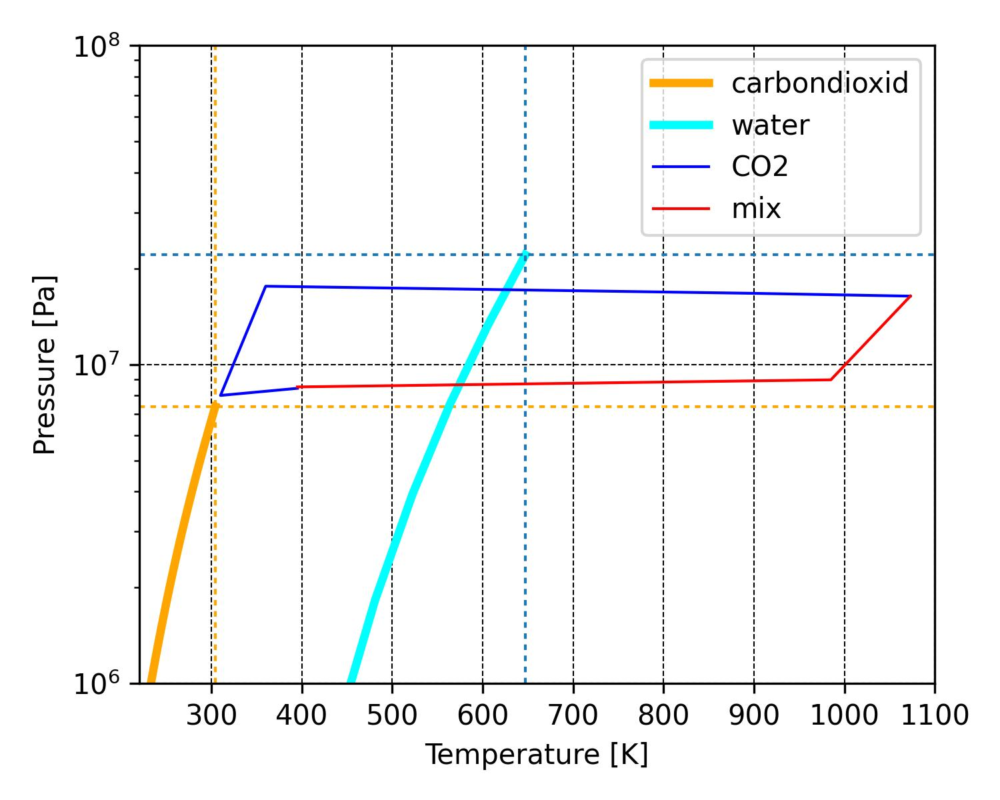
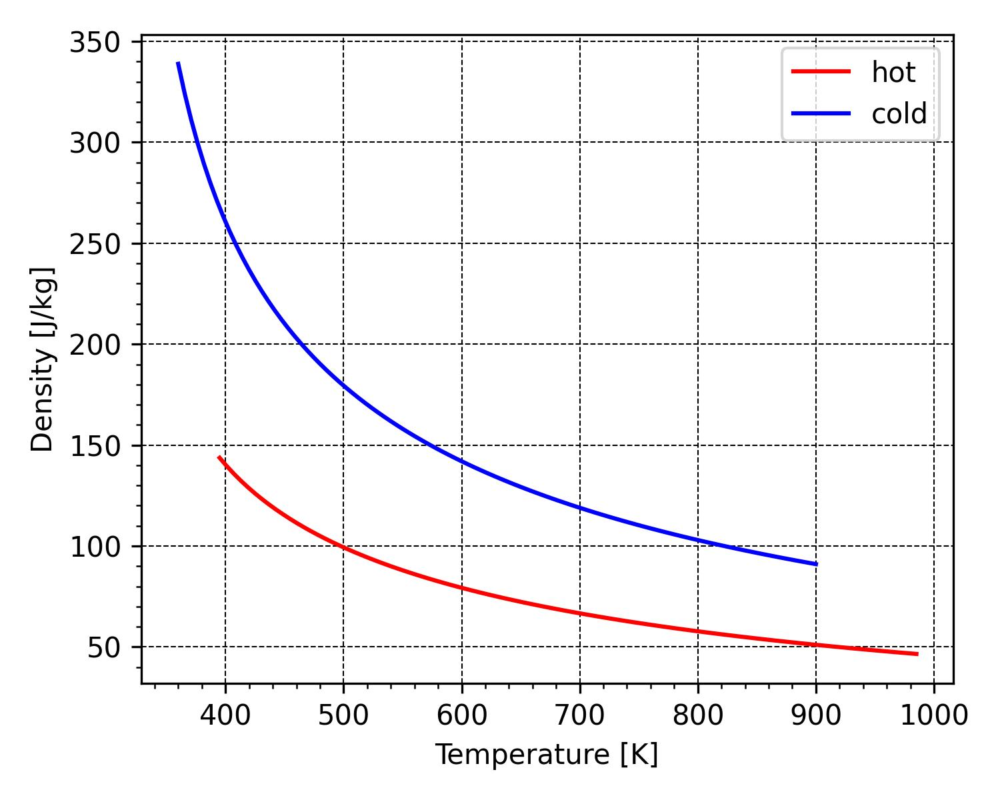
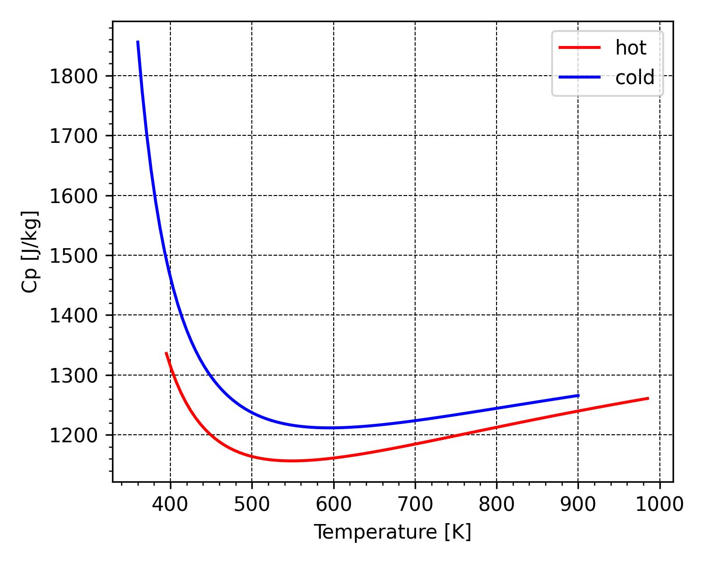
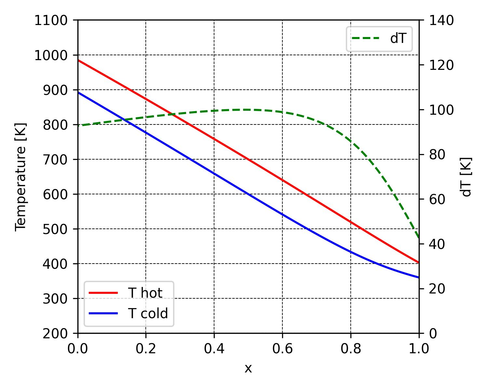

# Allam cycle calculation
The Allam cycle, patented in 2013 by Rodney Allam, 
uses oxy-combustion and a supercritical CO2 stream 
as the working fluid to produce high-purity liquid pipeline CO2.

The program is based on the liquid properties library `coolProp`.

# Navigation
<!-- TOC -->
* [Allam cycle calculation](#allam-cycle-calculation)
* [Navigation](#navigation)
* [Project structure](#project-structure)
* [Allam cycle diagram](#allam-cycle-diagram)
    * [Units systems](#units-systems)
  * [List of variables](#list-of-variables)
  * [List of methods](#list-of-methods)
  * [Parameters](#parameters)
  * [Returns:](#returns)
* [Examples](#examples)
  * [CO2 phase diagram](#co2-phase-diagram-)
  * [sCO2 thermodynamic properties](#sco2-thermodynamic-properties)
    * [Specific heat](#specific-heat)
    * [Compressibility](#compressibility)
    * [Theoretical useful work of the cycle](#theoretical-useful-work-of-the-cycle)
  * [Thermal model of the combustion chamber](#thermal-model-of-the-combustion-chamber)
    * [Calorimetric combustion temperature and gas composition calculation](#calorimetric-combustion-temperature-and-gas-composition-calculation)
    * [Calculation of recirculation coefficient](#calculation-of-recirculation-coefficient)
    * [Inlet gas composition](#inlet-gas-composition)
    * [Outlet gas composition](#outlet-gas-composition)
    * [Temperature dependence on recirculation coefficient](#temperature-dependence-on-recirculation-coefficient)
  * [Calculation of cycle parameters](#calculation-of-cycle-parameters)
    * [Calculation of cycle parameters at points](#calculation-of-cycle-parameters-at-points)
    * [Cycle efficiency](#cycle-efficiency)
    * [Phase diagram of the working fluid](#phase-diagram-of-the-working-fluid)
    * [Dependence of efficiency on recirculated gas temperature](#dependence-of-efficiency-on-recirculated-gas-temperature)
  * [Recuperator](#recuperator)
    * [Changing the density of the working fluid in the recuperator](#changing-the-density-of-the-working-fluid-in-the-recuperator)
    * [Change in heat capacity of the working fluid in the recuperator](#change-in-heat-capacity-of-the-working-fluid-in-the-recuperator)
    * [Changing the temperature of the working fluid in the recuperator](#changing-the-temperature-of-the-working-fluid-in-the-recuperator)
    * [Recuperator parameters](#recuperator-parameters)
  * [About the authors](#about-the-authors)
<!-- TOC -->


# Project structure

- `phasediagramCO2` class - an implementation of the CO2 phase diagram.
- `property-sCO2-cp` class - an implementation of the sCO2 properties.

# Allam cycle diagram


### Units systems
- temperature - Kelvins _[K]_;
- absolute pressure _[Pa]_

## List of variables
- `fluid` - name of gas (class instance `FluidList`)
- `mol_mass` - molar mass _[kg/mol]_
- `mol` - mole fraction
- `mass` - mass fraction

## List of methods


## Parameters
The fractional composition of the fuel is specified 
in the form of a dictionary. Key - faction name (str). Properties tuple:
- `fluid`
- `mol`
- volumetric heat of combustion at 0 deg. C _[J/m3]_

## Returns:


# Examples

## CO2 phase diagram 

Calculation of $CO_2$ phase diagram.

```python
from allam import PTdiagrCO2
diagr = PTdiagrCO2()
diagr.plot()
```


The drawing is saved in a file.

## sCO2 thermodynamic properties

### Specific heat

Dependence of specific isobaric heat capacity $sCO_2$ on pressure 
at different temperatures.

- `pressure` *(tuple)* - minimum and maximum absolute pressure *[Pa]*
- `temperature` *(tuple)* - temperature *[°C]*

```python
from allam import PropSCO2
temperature = (32, 40, 50, 60, 600)
ts = PropSCO2()
ts.diagramm_pressure(pressure=(1e6, 20e6), temperature=temperature)
```


The drawing is saved in a file.

Dependence of specific isobaric heat capacity on pressure at different temperatures.

```python
from allam import PropSCO2
ts = PropSCO2()
ts.diagramm_temperature(pressure=(7.4e6, 10e6, 15e6, 20e6), temperature=(20, 200))
```


The drawing is saved in a file.

### Compressibility

```python
from allam import PropSCO2
ts = PropSCO2()
ts.compressibility(pressure=(5e6, 10e6), temperature=(32, 40, 60, 100, 300, 500))
```


### Theoretical useful work of the cycle

```python
from allam import PropSCO2
ts = PropSCO2()
ts.work(pressure=(5e6, 10e6), pressure_rate=2., temperature=(32, 600))
```


## Thermal model of the combustion chamber

### Calorimetric combustion temperature and gas composition calculation

- `pressure` *(tuple)* - minimum and maximum absolute pressure *[Pa]*.
- `k_recyc` - recirculation ratio (dimensionless).
- `temp_recyc` - recirculation gas temperature *[°C]*.

```python
from allam import Combust
comb = Combust()
temp = comb._burnTemp(k_recyc=20, temp_recyc=900)
print(f'Calorimetric combustion temperature {temp:.1f} °C')
```

### Calculation of recirculation coefficient

- `temp_gas` - gas temperature at the outlet of the combustion chamber *[°C]*.
- `temp_recyc` - recirculation gas temperature *[°C]*.

```python
from allam import Combust
comb = Combust()
k_recyc = comb.burnAlpha(temp_gas=1000, temp_recyc=580)
print(f'Recirculation coefficient {k_recyc:.2f}')
```

### Inlet gas composition

```python
comb.gas_in
```

### Outlet gas composition

```python
comb.gas
```

### Temperature dependence on recirculation coefficient

```python
comb.tempAlphaPl(k_recyc=(5, 25), temp_recyc=580)
```



## Calculation of cycle parameters

### Calculation of cycle parameters at points

```python
from allam import Acycle
sco = Acycle()
sco.cycle(pressure_min=8e6, pressure_rate=2.2, temperature=(310,1073,900))
print(sco.p)
```

### Cycle efficiency

```python
print(sco.g)
```

Data is saved in `csv` files.

### Phase diagram of the working fluid

```python
from allam import PTdiagrmix
diagr = PTdiagrmix()
diagr.plot()
```



### Dependence of efficiency on recirculated gas temperature

```python
sco.efc_temp_heat((700,1000), pressure_min=8e6, pressure_rate=2.2, temperature=(310,500))
```


## Recuperator

### Changing the density of the working fluid in the recuperator

```python
from allam import HeatEx
rec = HeatEx()
rec.density()
```


### Change in heat capacity of the working fluid in the recuperator

```python
rec.spheat()
```





### Changing the temperature of the working fluid in the recuperator



```python
rec.solve()
```


### Recuperator parameters

```python
print(rec.r)
```


## About the authors
Sergey Besedin, dr. of sc., prof.

Andry Fydorov, engineer